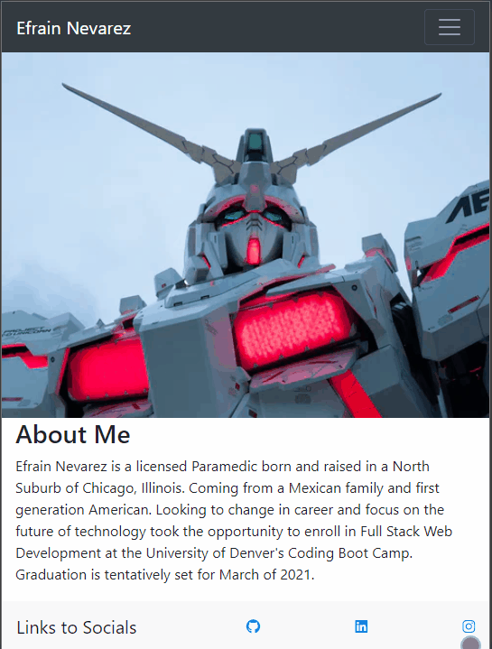

# Responsive Portfolio
 

 
### Table of Contents:
* [User Story](##-User-Story)
* [Description](##-Description)
* [Installation](##-Installation)
* [Credits](##-Credits)
* [Contributors](##-Contributors)
* [License](##-License)
 
## Deployed site
[Responsive Portfolio](https://enevarez-ops.github.io/responsivePortfolio/)

## User Story
This Website is a link to My User Responsive Portfolio, About Me and Contact Information
 
## Description
A Reactive portfolio using Bootstrap and CSS
 
## Installation
Run on Default Browser.
 
## Contributors
Efrain Nevarez
 
## Credits
CSS, Bootstrap
 
## License
This project is licensed by MIT